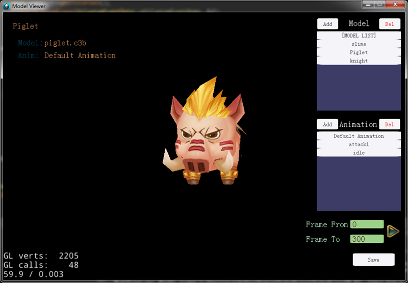

##	Branch of OPERATION_SUPPORT	##
For cocos2d-x after version 3.4

[Test on win7 64bit]

Read data from config.json , or use command line to select a file as source.

###Command line
	cd [path of ModelViewer]
	./ModelViewer JSON_DATA_PATH

###Keyboard
	Use arrow key to switch Model/Animation.

###ScreenShot

---------------------------------------------
## ModelViewer version 0.1 ##
It is for cocos2d-x after version v3.3

View .c3t/.c3b Model

Source code is here,
https://github.com/songchengjiang/cocos2d-x-ModelViewer

USAGE:

Command line
WIN/MAC:
cd [path of ModelViewer]
./ModelViewer MODELFILEPATH

Note: 
LEFT_MOUSE_BUTTON       --- Rotate Camera

RIGHT_MOUSE_BUTTON      --- Translate Camera

MIDDLE_MOUSE_BUTTON    --- Scale Camera

KEYBOARD_SPACE			--- Reset Camera

